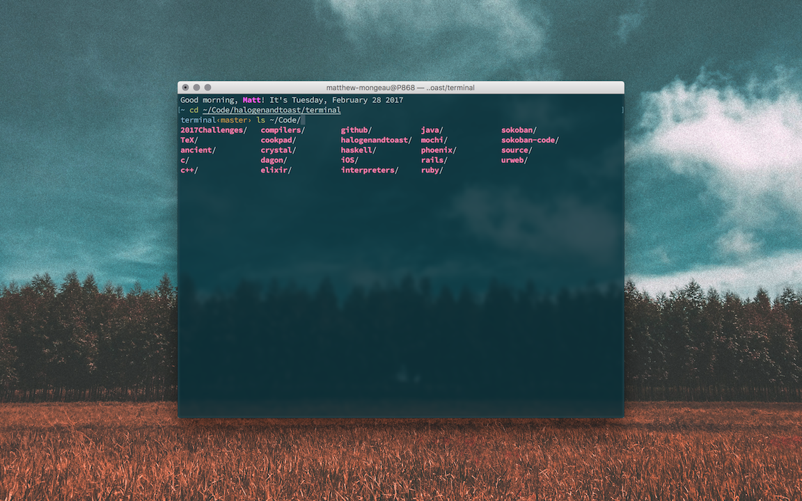

# Terminal Settings

## What it looks like



## Dependencies

This uses [OhMyZsh](https://github.com/robbyrussell/oh-my-zsh) with a custom theme

You'll also need to install the `Source Code Pro font`

With homebrew:

```
brew tap caskroom/fonts
brew cask install font-source-code-pro
```
